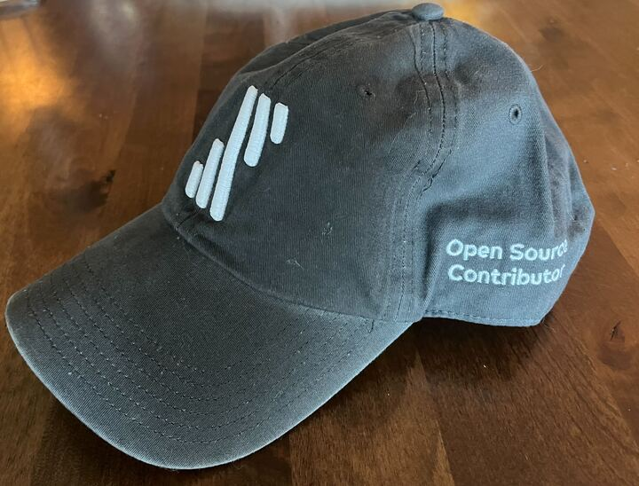

# ⚠️ Work In Progress ⚠️
# Standardized Fivetran Billing Model
## 📣 Overview
Over the years, the Fivetran Analytics Engineering team has been building analytics-ready templates for Fivetran connectors to ensure Fivetran customers are able to get the most value from their data as quickly as possible. As a result of making these out-of-the-box analytics templates we understand that each business domain (e.g. Billing, Finance, Ads, Marketing, etc.) typically result in the same reporting needs. Therefore, we are embarking on a journey to provide:

- Standardized analytics-ready templates for each business domain
- Common data models for entities (e.g. define the customer, product, transaction models)


To ensure the above strategy would be useful for Fivetran customers, we have decided to take a focused approach and begin with defining an initial standardized analytics-ready model for the Billing domain with the `line_item_enhanced` model. This `line_item_enhanced` model standardizes the denormalized invoice/order line item table containing revenue details and enriched with subscription, product, and customer information. Standardizing the model intended for the reporting process enures that Fivetran users have a consistent experience regardless of which billing platform they are using. This enhances usability and efficiency, making it easier for businesses to manage and analyze their billing data regardless of the specific platform. 

The initial plan is for the `line_item_enhanced` model to standardize the line item analytics layer for the following Fivetran billing platform connectors: 
- Stripe
    - [PR ready](https://github.com/fivetran/dbt_stripe/pull/82). If you have your own dbt project and use Stripe, you can test this out by adding the following to your `packages.yml` and running the `stripe__line_item_enhanced` model. Feel free to leave any comments or suggestions on the [PR](https://github.com/fivetran/dbt_stripe/pull/82).
```yml
packages:
  - git: https://github.com/fivetran/dbt_stripe.git
    revision: feature/standardized-billing-line-item-model
    warn-unpinned: false
```
- Shopify 
    - Not ready
- Recurly
    - Not ready
- Recharge
    - Not ready
- Zuora
    - Not ready

## 📄 Line Item Enhanced Standardized Schema
This Streamlit app showcases the denormalized `line_item_enhanced` model. The model was designed to capture the widest range of revenue activities within the above mentioned supported billing platform sources. For a comprehensive overview of the `line_item_enhanced` schema and field definitions, you can refer to the [billing_schema](/billing_schema) tab. Some opinionated decisions were made in order to ensure uniformity of the schema across platforms.

## 📈 Example reports
A few example reports were generated from the denormalized `line_item_enhanced` data model within this Streamlit app using fake data generated to simulate the billing platform of the fictional Dunder Mifflin company. These example reports can be found within the [bill_report](/billing_report) tab. For details around each section in the billing_report, see the descriptions below.

| **Report** | **Description** |
|----------|-----------------|
| [Current Period Revenue Metrics](https://fivetran-standardized-billing-model.streamlit.app/billing_report#current-period-revenue-metrics) | Showcases total and averages of key revenue metrics as well as monthly revenue and MRR over time. |
| [Subscription Metrics](https://fivetran-standardized-billing-model.streamlit.app/billing_report#subscription-metrics) | Highlights subscription activity in total and over time. | 
| [Revenue Analysis by Product](https://fivetran-standardized-billing-model.streamlit.app/billing_report#revenue-analysis-by-product) | Breakdown of total revenue by product type or product name as well as the same breakdown over time. | 
| [Customer Analysis](https://fivetran-standardized-billing-model.streamlit.app/billing_report#customer-analysis) | Analyzes customer lifetime value, average revenue per customer, and overall churn rate.  | 

## 🎯 Call to Action
As mentioned, this report and the denormalized `line_item_enhanced` model are very much a work in progress and in the initial feedback phase. It would be much appreciated if you can take the time to review the schema and example reports and provide your feedback and suggestions using our [Google Feedback Form](https://forms.gle/rSRXxM6SLyDU9Am47). When you submit feedback via the form provided, you enter yourself for a chance to win a Fivetran Open Source Contributor hat (limited to those residing in the continental US)! Thank you!


